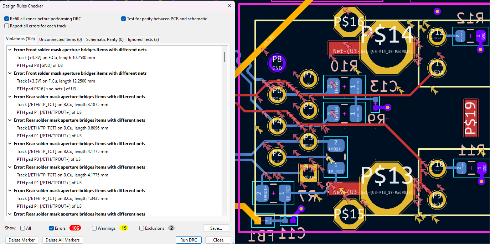

# solder_mask_modifier
This plugin allows to modify the solder mask of all PADS in a list of components.

## Problem solved
It is intended to solve the DRC bug **"Solder mask aperture bridges items with different nets ”**. 

One of the ways people are solving this problem is by modifying the DRC severity or allowing bridges.

This plugin allows you to eliminate the problem, not just patch it.

## Solution on which it is based
To fix it effectively, you should
1. Open the footprint editor of the component.
2. In the editor, modify each one of the pads.
3. Save the change

The problem, is that this is very long and tedious to do, for it this plugin

# Installation
Copy `solder_mask_modifier.py` to the `scripting/plugins` path, in my case it would be in this path

> `C:\Users\Jairo\Documents\KiCad\8.0\scripting\plugins`.

# Usage
With the `.py` in the correct path, open the pcb editor and run the plugin

`Tools > external plugins > Sodler Mask Modifier`.

Now, we put the name of the components (respecting upper and lower case), and in case of being several components, put them followed by commas and without spaces `U3,CLK2,j2`. Then set the size of the solder mask (usually 0).

Finally, `Apply changes` and `close` (don`t use X)

Translated with DeepL.com (free version)
