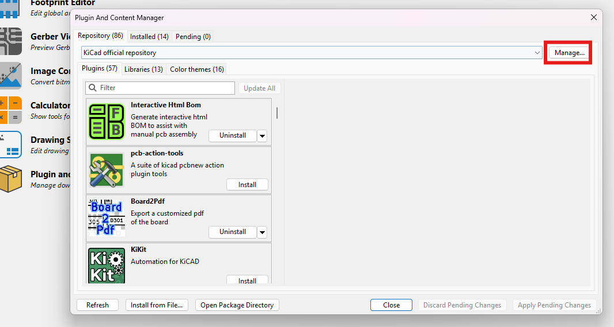

# solder_mask_modifier
Este plugin permite modificar la "solder mask" de todos los PADS de una lista de componentes.

## Problema que soluciona
Está pensado para solucionar el error de DRC **"Solder mask aperture bridges items with different nets"**. 

Una de las formas en la que la gente está resolviendo este problema, es modificando la severidad de las DRC o permitiendo los gridges.

Este plugin permite eliminar el problema, no sólo parchearlo.

## Solución en la que se basa
Para arreglarlo de forma eficaz, habría que
1. Abrir el editor de la huella del componente
2. En el editor, modificar cada uno de los pads
3. Guardar el cambio

El problema, es que esto es muy largo y aburrido de hacer, para ello este plugin

# Instalación
Añadir el repositorio de github a tu KiCAD, clicando en el botón `Manage...`

Luego, añadir el json de este repositorio tras darle al botón `+`, quedando tal que:
